<!-- Generated by `qits database diagram` (jpa). Do not edit: the entity-diagram automation rewrites this file on every release request fold. -->
# Persistence unit `maintenance`

Datasource `maintenance` · package `eu.wohlben.qits.maintenance.entity` · 18 entities

```mermaid
erDiagram
  %% mt_artifact: eu.wohlben.qits.maintenance.entity.MtArtifact (maintenance)
  mt_artifact {
    uuid id PK "not null"
    string ecosystem "not null, length 32"
    instant ingested_at
    string name "not null, length 512"
    instant occurred_at "not null"
    string project_id "length 64"
    string repository "length 255"
    uuid run_id
    text sbom_error
    string sbom_status "not null, length 32"
    string section "length 16"
    string version "not null, length 255"
  }
  %% mt_artifact_component: eu.wohlben.qits.maintenance.entity.MtArtifactComponent (maintenance)
  mt_artifact_component {
    uuid id PK "not null"
    uuid artifact_id "not null"
    string bom_ref "length 1024"
    boolean direct "not null"
    string ecosystem "length 32"
    string name "length 512"
    string purl "length 1024"
    string version "length 255"
  }
  %% mt_artifact_edge: eu.wohlben.qits.maintenance.entity.MtArtifactEdge (maintenance)
  mt_artifact_edge {
    uuid id PK "not null"
    uuid artifact_id "not null"
    uuid child_component_id "not null"
    uuid parent_component_id
  }
  %% mt_branch: eu.wohlben.qits.maintenance.entity.MtBranch (maintenance)
  mt_branch {
    uuid id PK "not null"
    string branch "not null, length 512"
    string group_name "not null, length 255"
    string head_sha "length 64"
    string repository "not null, length 255"
    string state "not null, length 32"
    instant updated_at "not null"
  }
  %% mt_bump: eu.wohlben.qits.maintenance.entity.MtBump (maintenance)
  mt_bump {
    uuid id PK "not null"
    text automation_extras
    string automation_kind "length 64"
    boolean automation_only
    string branch "not null, length 512"
    text changes
    string ci_event_id "length 255"
    text ci_run_id
    string ci_run_status "length 32"
    string environment "not null, length 64"
    instant finished_at
    string fold_sha "length 64"
    string group_name "not null, length 255"
    text message
    string mode "not null, length 16"
    string previous_fold_sha "length 64"
    text release_detail
    string release_request_id "length 255"
    string release_state "length 32"
    instant release_state_at
    string repository "not null, length 255"
    string result_sha "length 64"
    instant started_at "not null"
    string status "not null, length 32"
    string trigger "not null, length 32"
    string work_item "length 64"
  }
  %% mt_bump_window: eu.wohlben.qits.maintenance.entity.MtBumpWindow (maintenance)
  mt_bump_window {
    string id PK "not null, length 32"
    instant closes_at "not null"
    instant opened_at "not null"
  }
  %% mt_gitlink_pin: eu.wohlben.qits.maintenance.entity.MtGitlinkPin (maintenance)
  mt_gitlink_pin {
    uuid id PK "not null"
    string ecosystem "not null, length 32"
    string gitlink_path "not null, length 1024"
    string manifest_path "not null, length 1024"
    string name "not null, length 512"
    string repository "not null, length 255"
    string sha "not null, length 64"
    string submodule "not null, length 255"
    string version "not null, length 255"
  }
  %% mt_gitlink_tree: eu.wohlben.qits.maintenance.entity.MtGitlinkTree (maintenance)
  mt_gitlink_tree {
    uuid id PK "not null"
    text pins "not null"
    instant read_at "not null"
    string sha "not null, length 64"
    string submodule "not null, length 255"
  }
  %% mt_group: eu.wohlben.qits.maintenance.entity.MtGroup (maintenance)
  mt_group {
    uuid id PK "not null"
    string kind "length 32"
    string name "not null, length 255"
    int ordinal "not null"
    text patterns "not null"
    string repository "not null, length 255"
    string source "not null, length 32"
  }
  %% mt_latest: eu.wohlben.qits.maintenance.entity.MtLatest (maintenance)
  mt_latest {
    uuid id PK "not null"
    instant checked_at "not null"
    string ecosystem "not null, length 32"
    text error
    string latest "length 255"
    string name "not null, length 512"
    text source_url
  }
  %% mt_pin: eu.wohlben.qits.maintenance.entity.MtPin (maintenance)
  mt_pin {
    uuid id PK "not null"
    string ecosystem "not null, length 32"
    string kind "not null, length 32"
    string location "not null, length 512"
    string manifest_path "not null, length 1024"
    string name "not null, length 512"
    string range "length 255"
    string repository "not null, length 255"
    string version "not null, length 255"
  }
  %% mt_release: eu.wohlben.qits.maintenance.entity.MtRelease (maintenance)
  mt_release {
    uuid id PK "not null"
    instant occurred_at "not null"
    string repository "not null, length 255"
    string sha "not null, length 64"
    string version "not null, length 255"
  }
  %% mt_release_pin: eu.wohlben.qits.maintenance.entity.MtReleasePin (maintenance)
  mt_release_pin {
    uuid id PK "not null"
    string ecosystem "not null, length 32"
    string name "not null, length 512"
    uuid release_id "not null"
    string version "length 255"
  }
  %% mt_repository: eu.wohlben.qits.maintenance.entity.MtRepository (maintenance)
  mt_repository {
    string name PK "not null, length 255"
    text archetype
    string catalog_id "length 64"
    string head_sha "length 64"
    instant last_scan_at
    string main_branch "length 255"
    text message
    string project "length 255"
    string status "not null, length 32"
  }
  %% mt_sbom_check_run: eu.wohlben.qits.maintenance.entity.MtSbomCheckRun (maintenance)
  mt_sbom_check_run {
    uuid id PK "not null"
    boolean filed "not null"
    instant ran_at "not null"
    text report "not null"
  }
  %% mt_sbom_ticket: eu.wohlben.qits.maintenance.entity.MtSbomTicket (maintenance)
  mt_sbom_ticket {
    uuid id PK "not null"
    instant closed_at
    string ecosystem "not null, length 32"
    string name "not null, length 512"
    instant opened_at "not null"
    string project_id "not null, length 64"
    uuid ticket_id "not null"
    string ticket_slug "length 64"
  }
  %% mt_sbom_ticket_version: eu.wohlben.qits.maintenance.entity.MtSbomTicketVersion (maintenance)
  mt_sbom_ticket_version {
    uuid ticket_row PK "not null"
    string version PK "not null, length 255"
    string reason "not null, length 16"
    instant reported_at "not null"
  }
  %% mt_scan: eu.wohlben.qits.maintenance.entity.MtScan (maintenance)
  mt_scan {
    uuid id PK "not null"
    instant finished_at
    text message
    string repository "length 255"
    string scope "not null, length 32"
    instant started_at "not null"
    string status "not null, length 32"
    string trigger "not null, length 32"
  }
```

